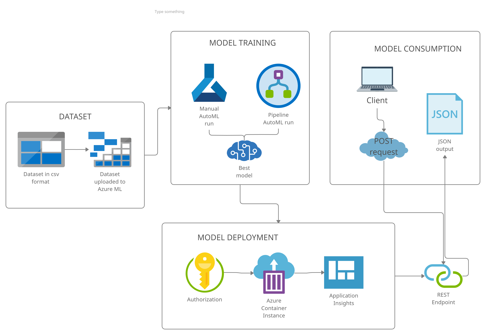
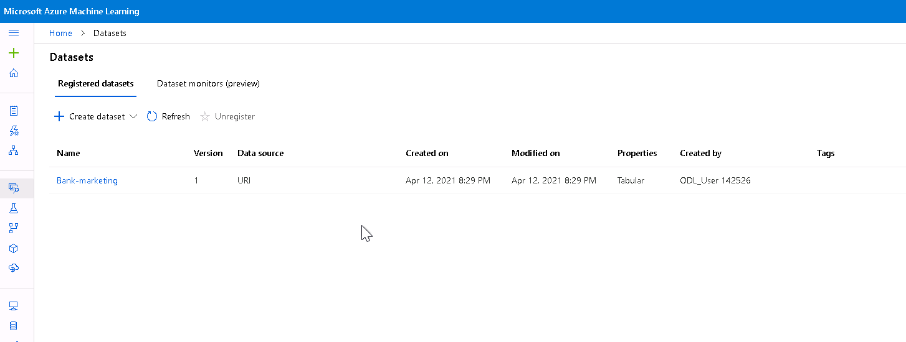
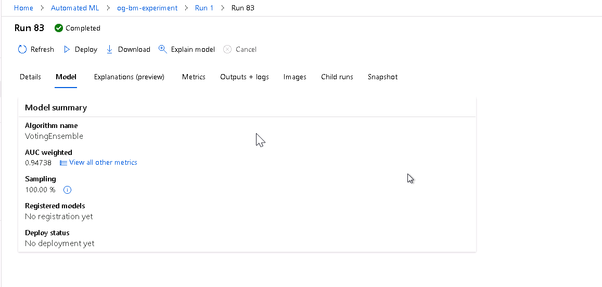

## Project Overview 

This project is part of the Udacity Azure ML Nanodegree.

The purpose of this project is to configure, build, deploy and consume a cloud-based machine learning production model, both manually in AzureML Studio and automatically via a pipeline. 

The project uses the details about the clients of direct marketing campaigns of a Portuguese banking institution to determine if the clients are likely to subscribe to a bank term deposit. The dataset contains various information about the client: demographic variables, presence of loans, last contact details, outcome of the previous marketing campaign, employment and consumer information. Detailed description of the variables can be found here: https://archive.ics.uci.edu/ml/datasets/Bank+Marketing 

**Problem statement**: using the information about the client, assess whether the client will subscribe to a bank term deposit or not. The purpose of this analysis is to identify the most relevant clients for next marketing steps, and to increase bank profit by offering the term deposit product to the proper audience. 

The client will consume the model by sending client details, and receiving a response "yes" or "no" indicating that the client is either likely to subscribe to the rerm deposit or not. 

## Architectural Diagram 

## Future Improvements

Two important improvements to the project in the future are:
- learning on new data to avoid data drift
- consuming expert feedback to improve the model

Every model should be refined and updated in the course of time. By consuming additional training data and updating the model, we can ensure that the model provides relevant results. It would be efficient to automate this process as a pipeline.

Clients can also provide feedback on the data points they consumed and on the actual customer response. Based on this feedback, the model can be further improved and refined. 

## Project Main Steps and Screenshots

### AutoML experiment
1. Registered datasets

2. Experiment is shown as completed

3. Best model 

## Screencast Video 
Screencast of main steps and project demo: https://youtu.be/ZWCnZ-xlyEM 
